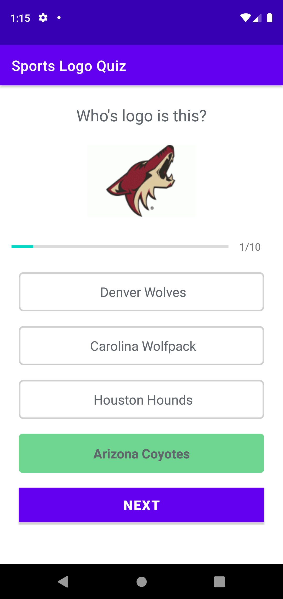
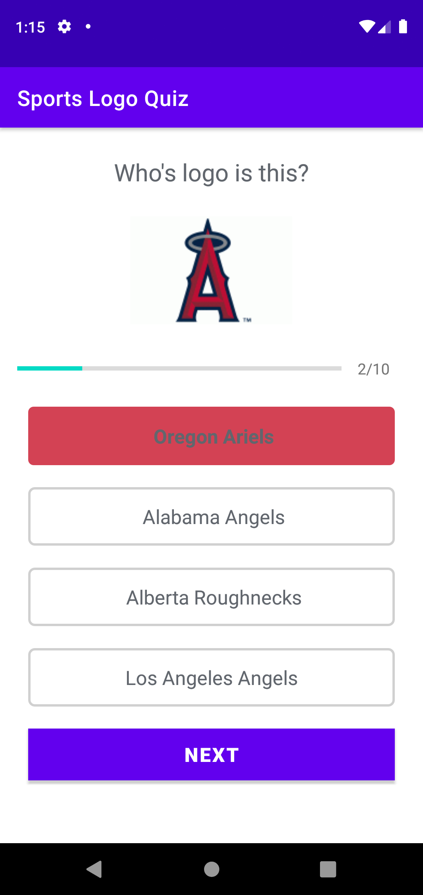

# pop-quiz
A logo quiz app where the user guesses the name of the team the logo belongs to.

## Starting a new game
The user enters their name which is passed by an intent to the final activity

## Selecting the correct answer
The user has made a correct selection, at this point they cannot change their answer.

## Selecting the incorrect answer
The user has made an incorrect selection. At this point they cannot make another selection.

## User results are revealed
The users results are revealed with a progress bar.
[CircularProgressBar](https://github.com/lopspower/CircularProgressBar.git)
